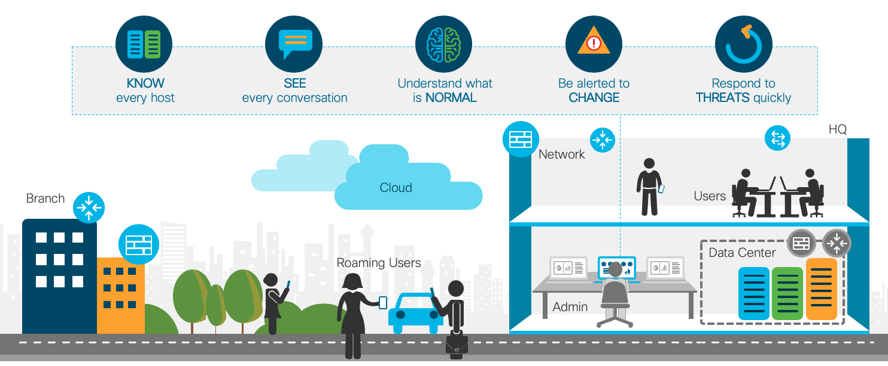
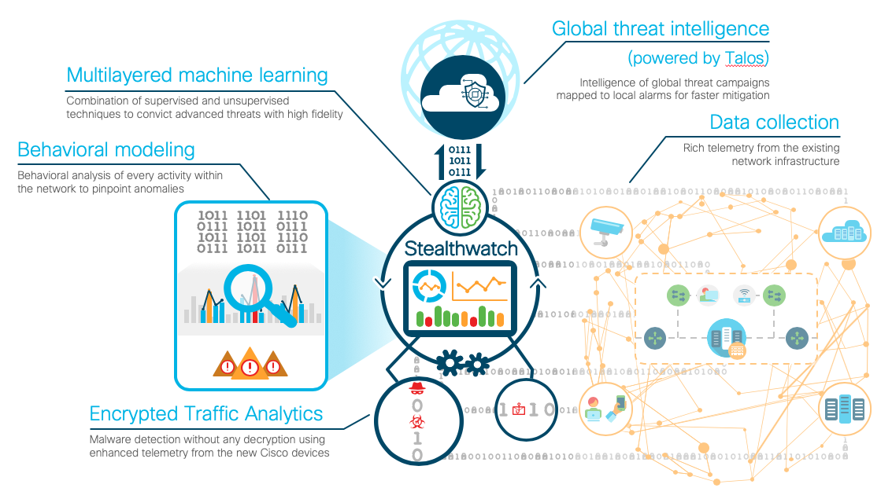

# Introduction to Cisco Secure Network Analytics

This section provides a theoretical foundation for future hands-on activities. Read this information before continuing.

* Defining Cisco Secure Network Analytics.
* Network traffic visibility.
* The data collection and machine learning analytics.

## What is Cisco Secure Network Analytics?

Digitization introduces significant benefits, but it also increases complexity and can create "blind spots" in network security. The following factors increase the network attack surfaces:

* **Enterprise Mobility**: Employees want to work from anywhere on any device. Organizations lack visibility into the behavior of devices on their network.
* **Acquisitions and Partnerships**: Within the enterprise, threats can move between branches and to headquarters.
* **Cloud**: Many security professionals believe that the public cloud creates the most significant risk for cyber attacks.
* **Internet of Things**: Many smart devices can connect to an enterprise network.
* **Encrypted Traffic**: Organizations often use encryption for data protection and privacy. However, if an organization cannot decrypt HTTPS, targeted web malware can escape detection.

At the same time, threats are evolving and getting smarter:

* **Motivated and targeted adversaries**: Adversaries are not only interested in revenue generation from attacks. They can also destroy services and data completely to disrupt the business or commit espionage. Attackers that steal critical information want to get in, get the data, and get out undetected.
* **Insider Threats**: Insider threats include disgruntled employees, insecure admin or privileged accounts, or credentials compromised by phishing, theft, or negligence. Insider threats are difficult to detect.
* **Increased attack sophistication**: Adversaries attack through malware, spyware, and ransomware and vulnerabilities in the infrastructure. Attacks can take the form of advanced persistent threats, encrypted malware, and zero-day exploits.

## Secure Network Analytics and traffic visibility

Secure Network Analytics provides visibility into an entire network infrastructure and enables administrators to quickly minimize the impact of threats to critical information. Secure Network Analytics enlists the network to provide end-to-end visibility into traffic, providing you with total visibility across every security touchpoint.

This visibility enables you to know every host and identify the information that any users are accessing at any given point. You can recognize normal behavior for a particular user or host and establish a baseline, which enables instant alerts to changes in the user’s behavior.

## Secure Network Analytics Security Analytics

Five main elements of Security Analytics enable you to detect advanced threats in real time.

### Data collection

Routers, switches, firewalls, and other network components can deliver rich telemetry. Encrypted Traffic Analytics can analyze encrypted traffic to detect malware without decryption and govern the quality of network encryption within your digital business.

Secure Network Analytics also collects metadata from Cisco Identity Services Engine (ISE), Cisco AnyConnect Network Visibility Module (NVM), and other supporting systems to make sure you have user and application context to the network behavioral analytics.

Secure Network Analytics acts as a "general ledger" for your digital business ensuring that you have an account of all user behavior and traffic over time.  

### Behavioral modeling

Secure Network Analytics closely monitors the activity of every device on the network and is able to create a baseline of normal behavior. Secure Network Analytics also has a deep understanding of known bad behavior, which is implemented by applying close to 100 different Security Events or heuristics to look at many types of traffic behavior.

### Multilayered machine learning

Secure Network Analytics also applies supervised and unsupervised machine learning to discover advanced threats and malicious communications. It integrates with a cloud-based, multistage machine learning analytics pipeline that correlates threat behaviors that are seen in the enterprise with behaviors seen globally.

### Global Threat Intelligence

The industry-leading threat intelligence group [Cisco Talos](https://www.talosintelligence.com/) powers a global threat intelligence feed that provides an extra layer of protection against botnets and other sophisticated attacks.

Talos correlates suspicious activity in the local network environment with data on thousands of known command-and-control servers and campaigns. This intelligence provides high fidelity detection and faster threat response. Cisco Talos sees 1.5 million unique malware samples daily and blocks 20 billion threats per day.

### Encrypted Traffic Analytics

Secure Network Analytics is the only solution that can analyze encrypted traffic without decryption. It uses the enhanced telemetry from the new Cisco network and applies a combination of advanced analytics to detect malware and ensure cryptographic compliance.

## Secure Network Analytics features

Cisco Secure Network Analytics uses the different analytics to provide the following features.

### Contextual network-wide visibility

Secure Network Analytics ingests and analyzes the telemetry from multiple network devices on premises. It also natively collects telemetry from the public cloud infrastructure. Secure Network Analytics uses entity modeling to classify all the devices or entities that are connected to the network, including servers, printers, and more.

Secure Network Analytics can provide contextual information about the source of the threat. This information includes where it might have propagated, which user has been compromised, location, device type, time-stamp, and more. Secure Network Analytics can also store telemetry for a specified period, which enables forensic investigation of past or long-running events through integrations with other security solutions. This enables analysis of user and application data, web information, and more for faster threat investigation and response.

### Predictive threat analytics

Cisco Secure Network Analytics constantly observes network activities to create a baseline of normal behavior, and uses up to 100 different heuristics to generate alarms on any anomalies. It also generates alarms from knowledge of known bad behavior. For example, if attackers use lost or stolen credentials to gain access, or a malicious employee hoards or exfiltrates sensitive data, Secure Network Analytics can generate an alarm on it right away.

Secure Network Analytics also uses cloud-based machine learning techniques to detect advanced threats and malicious campaigns. These techniques identify malicious servers across the world and flag any communication to them.

Secure Network Analytics uses global threat intelligence that is powered by the industry-leading Talos platform to correlate local threats globally, and thwart attackers’ rinse-and-repeat tactics of infecting multiple victims with the same malware.

### Automated detection and response

The combination of this context-driven enterprise-wide visibility and the application of advanced analytical techniques leads to advanced, high-fidelity threat detection. Security teams see alarms that are prioritized by threat severity, and have additional information to take actions easily. An alarm can have an associated response:
    * Notify in the alarm table
    * Generate an email
    * Generate a syslog message to a SIEM
    * Quarantine identified threats using the network (Containment through Adaptive Network Control using ISE integration)

**Next: Intro to the dataset and Pandas**