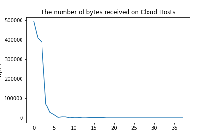
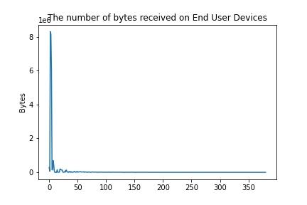
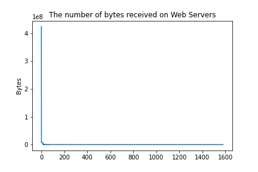
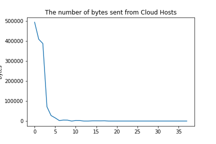
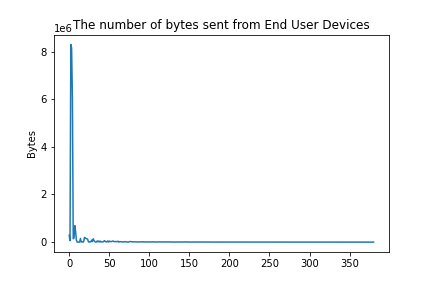
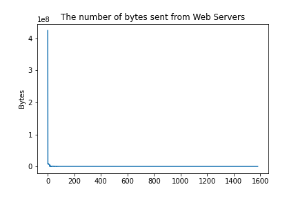

# Hands-on excercise: detect above-average flows
In the last step, we will create a script that can detect above-average flows. 

> **Note:** Cisco Secure Network Analytics has a very powerful engine to do anomoly detection. For the purpose of this labs, we are simplifying this.


## Objectives

After this step, you should be able to:
* Learn how to plot using `matplotlib.pyplot`
* Compare values and return a value based on this comparison. 
* Learn how to use the `query()` method of `pandas`
* Learn how to concatenate a list of DataFrames into one DataFrame

## Let's detect the outliers!

Let's take a closer look at our DataFrame and see whether we can detect outliers among the data we collected. 

1. Usually, we start by inspecting the data manually in order to get a feel for the data. We can use the `matploblib.pyplot` library for this. We plot the number of bytes sent and received per hostgroup. 

```python
def plot_flows(aggregates_dict, sent_or_received):
    for subject_host_group in aggregates_dict:
        plt.figure()
        x = np.arange(len(aggregates_dict[subject_host_group]))
        y = np.array(aggregates_dict[subject_host_group])

        plt.plot(x,y)
        plt.title(f'The number of bytes {sent_or_received} from {subject_host_group}')
        plt.ylabel('Bytes')
        
        plt.show()
```








From the output above, we can see that there are some clear outliers that are heavily influencing the averages. 

2. Let's filter out the anomalies and outliers in our DataFrame. We want to extract the values that exceed the average and we want to take a closer look at it. There is a built-in method in `pandas` that allows us to query in the style of SQL, e.g., ```df.query('`Subject Bytes`>1000 & `Subject Host Groups`=="Web Servers"')``` will give us all the rows where the `Subject Bytes`exceed 1000 and where the `Subject Host Groups` is equal to Web Servers. We can do this for all host groups: 

```python 
for subject_host_group in averages_dict:
        sub_df = df.query(f'`Subject Bytes` > {averages_dict[subject_host_group]} & `Subject Host Groups` == "{subject_host_group}"')
```

3. We can store the output of this in a DataFrame. Moreover, we can concatenate all of these DataFrames into one DataFrame. We can do this by putting all these DataFrames in a list and pass this list onto the `concat()` method of `pandas`. 

```python
def detect_above_average_flows(df, sent_or_received):
    peer_or_subject_bytes = check_sent_or_received(sent_or_received)
    averages_dict = average_bytes_per_hostgroup_sent_or_received(df, sent_or_received)

    df_list = []
    for subject_host_group in averages_dict:
        sub_df = df.query(f'`Subject Bytes` > {averages_dict[subject_host_group]} & `Subject Host Groups` == "{subject_host_group}"')
        df_list.append(sub_df)
    anomaly_df = pd.concat(df_list)
    return anomaly_df
```
4. Go ahead and try it out yourself! Inspect the anomalies manually and try to understand what is happening for each situation. 

```python
# Hands-on excercise: detect above-average flows
#TODO plot_flows(total_sent, 'sent')
#TODO plot_flows(total_received, 'received)
#TODO print(detect_above_average_flows(df, "sent"))
#TODO print(detect_above_average_flows(df, "received"))
```


**Next Step: Wrap-Up**